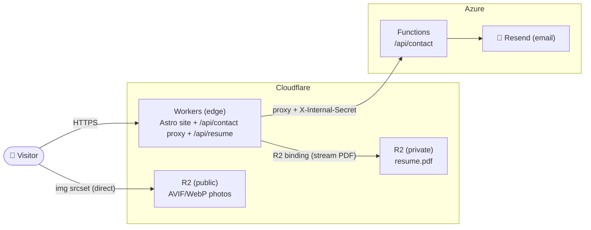

# shiqihu.com — Personal Portfolio

The code behind my corner of the internet: engineering work I'm proud of, photos I've taken, and a form you can use to reach me.

Built for speed: fully static HTML/CSS at load time, with JavaScript only where interaction is needed. Powered by Astro and React islands, deployed on Cloudflare Workers with a serverless contact API and a Cloudflare R2 image pipeline.

100/100 Lighthouse score on Performance, Accessibility, Best Pratices, and SEO

## [→ Visit shiqihu.com](https://shiqihu.com)

## Table of contents
- [Tech stack](#tech-stack)
- [Key tradeoffs](#key-tradeoffs)
- [Architecture](#architecture)
- [Notable implementation details](#notable-implementation-details)
- [Project structure](#project-structure)
- [Testing](#testing)
  - [What is tested](#what-is-tested)
  - [How they are tested](#how-they-are-tested)
  - [Tool choices](#tool-choices)
- [License](#license)

## Tech stack

| Layer | Technology | Why |
| --- | --- | --- |
| Framework | **Astro 7** | Static-first, ships zero JavaScript by default; fast loads and strong SEO out of the box. |
| Interactivity | **React 19 islands** | Interactive pieces (theme toggle, gallery lightbox, contact form) hydrate independently; JS is scoped to where it's needed. |
| Language | **TypeScript (strict)** | End-to-end type safety across UI, data, and the serverless API. |
| Styling | **Tailwind CSS v4** | Utility-first styling with a single design-token source of truth (CSS variables) driving light/dark themes. |
| Animation | **Motion** | Subtle, accessible entrance and hover motion; respects `prefers-reduced-motion`. |
| Icons | **lucide-react** | Tree-shakeable SVG icon set. |
| Hosting & CI/CD | **Cloudflare Workers** | Global edge network, free SSL, deployed via `wrangler deploy`; pull requests run lint, type-check, and both test suites in GitHub Actions before merge. |
| API | **Azure Functions (Node 24, TS)** | The `/api/contact` endpoint validates input, applies a honeypot + rate limit, and sends email. |
| Media | **Cloudflare R2** | S3-compatible object storage serving a responsive AVIF/WebP image pipeline for the photography gallery. |

## Key tradeoffs

**Astro over a React-based meta-framework (Next.js / Remix)**

A portfolio is almost entirely static content, so the trade-off is straightforward. Next.js ships a JS runtime and hydrates the full page by default; every visitor pays that cost even when they're just reading text. Astro flips the default: pages are pure HTML/CSS, and JavaScript is opt-in per component via islands. The result is a significantly smaller JS bundle and faster Time to Interactive, with no meaningful loss of capability for this use case. React is still used where it earns its keep (the theme toggle, gallery lightbox, and contact form) but it doesn't come along for the ride everywhere else.

## Architecture



- **Cloudflare Workers** serves the Astro-built site at the edge (`wrangler deploy`) and hosts two API routes: `/api/contact` (proxied to Azure) and `/api/resume` (streams the PDF from the R2 binding).
- **Cloudflare R2** serves media two ways: photos live in a public bucket the browser fetches directly via `` (no runtime image processing), while `resume.pdf` sits in a private bucket reachable only through the Worker's `RESUME_BUCKET` binding.
- **Azure Functions** is a separate deployment (`api/`) that handles contact form submissions, validates input, and sends email via Resend.

## Notable implementation details

**Contact form: two-layer serverless architecture**

The contact form uses a deliberate split between Cloudflare and Azure to keep all secrets and logic off the client.

*Request flow:* the React form `POST`s to `/api/contact` on the Cloudflare Worker. The Worker (`src/pages/api/contact.ts`) is a thin proxy that forwards the request body to Azure Functions and injects an `X-Internal-Secret` header read from a Cloudflare Worker secret. Azure Functions (`api/src/functions/contact.ts`) does all the real work: it validates the secret, sanitises input, applies spam protection, and sends the email via Resend.

*Why two layers?*
- The Azure Functions URL and the Resend API key never reach the browser or the repository.
- The shared secret (`CONTACT_FORM_SECRET`) means even if someone discovers the Azure URL directly, every request without the correct secret is rejected with a 403. The Worker is the only authorised caller.
- Keeping validation and email-sending in Azure decouples them from the Cloudflare deployment cycle.

**Spam protection**

Two layers defend the contact endpoint without requiring a CAPTCHA:

- *Honeypot field*: a hidden `company` input is invisible and unfocusable to real users. Bots that auto-fill forms trigger it; Azure silently returns 200 so bots don't learn they were caught.
- *In-memory rate limiter*: the Azure Function tracks submission timestamps per client IP (max 5 per 10 minutes) and rejects excess requests with a 429.

**Email cap fallback**

When the Resend API returns a 429 (monthly send limit reached on the free tier), Azure responds with a machine-readable `EMAIL_CAP_REACHED` error rather than a generic error. The contact form detects this and renders a dedicated state that surfaces an alternative email address, so a degraded form never leaves a visitor with no way to reach out.

## Project structure

```
src/
  components/   UI components (Astro) + React islands (.tsx)
  sections/     Page sections (Hero, About, Experience, Projects, Photography, Contact)
  layouts/      BaseLayout.astro (meta / OG / SEO, no-flash theme)
  data/         Content as typed data (profile, experience, projects, photos)
  lib/          Helpers (responsive-image srcset, nav config)
  styles/       globals.css (Tailwind + design tokens)
  pages/        Base Layout, 404, Privacy Policy
api/            Azure Functions (contact endpoint)
scripts/        optimize-and-upload-photos.ts (sharp → AVIF/WebP → R2)
```

## Testing

The contact feature is the only stateful, user-facing piece with a real backend, so it carries two layers of automated tests. The rest of the site is static content rendered at build time, with no runtime branching to exercise.

### What is tested

**Contact form UI (`ContactForm.tsx`):** client-side validation (empty fields, invalid email), the honeypot field, button state during in-flight requests, and every UI state it renders: idle, submitting, success, error, and the email-cap fallback.

**Contact API (`/api/contact`):** the handler is a thin proxy to the Azure Function, which owns validation, rate limiting, and Resend delivery. Its tests verify the proxy contract: forwarding to `AZURE_CONTACT_URL` with the internal secret header, request-body pass-through, and faithful pass-through of Azure's status and body (success plus 400 validation, 429 rate-limit, 503 `EMAIL_CAP_REACHED`, and 502 upstream errors).

A full test case catalogue is in [tests/README.md](tests/README.md).

### How they are tested

**Unit tests** exercise each layer in isolation, keeping feedback instant and failures easy to locate:

- The React component renders into a virtual DOM (jsdom), with `fetch` stubbed so state transitions are driven entirely by controlled mock responses.
- The Worker handler runs directly as a TypeScript function, bypassing HTTP; the Cloudflare `env` binding and `fetch` are both stubbed, so every branch is reachable without a running Worker.

**End-to-end tests** drive the assembled feature in a real browser, catching wiring and hydration bugs that isolated tests cannot:

- A real Chromium instance runs against the live Astro dev server, which Playwright starts automatically.
- `/api/contact` is intercepted at Playwright's network layer before any request leaves the browser, so no emails are sent.
- The helper waits for `form[data-hydrated]` (an attribute set by `useEffect` after React mounts) before interacting, avoiding the race where server-rendered HTML is visible but event handlers are not yet attached.

### Tool choices

| Tool | Role | Why |
|------|------|-----|
| **Vitest** | Unit test runner | Native ES-module support and first-class TypeScript without a build step; Vite-based projects share config naturally. Fast watch mode and a Jest-compatible API mean no learning curve. |
| **React Testing Library** | Component rendering | Encourages querying by accessible role/label rather than implementation details, so tests break when behaviour changes, not when markup is refactored. |
| **@testing-library/user-event** | User interaction simulation | Fires the full sequence of browser events (`pointerdown`, `keydown`, `input`, `change`, `keyup`, `pointerup`, `click`) rather than a single synthetic event, catching bugs that a bare `fireEvent` misses. |
| **Playwright** | E2E browser automation | First-class TypeScript, auto-waiting assertions, and built-in network interception (`page.route`) make it the natural fit here. The ability to intercept `/api/contact` at the network layer means E2E tests are self-contained and deterministic without a live email service. |

## License

See [LICENSE](LICENSE).
